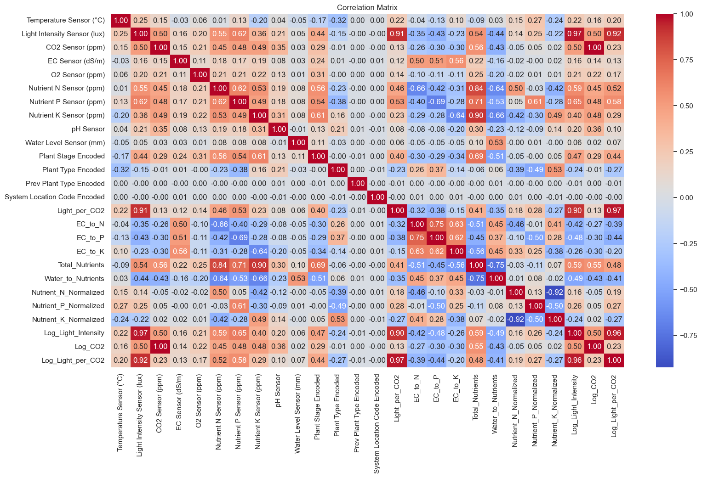
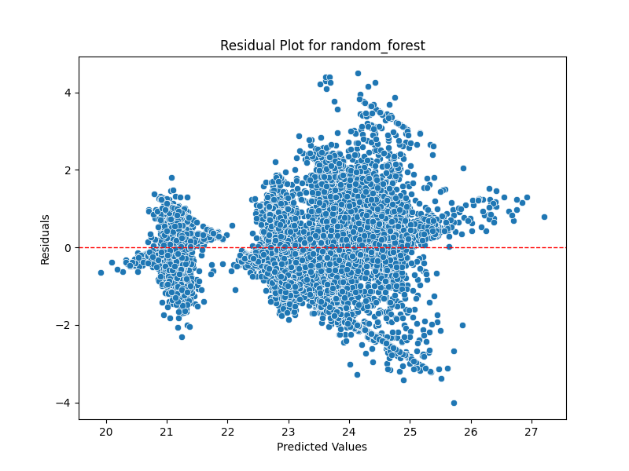
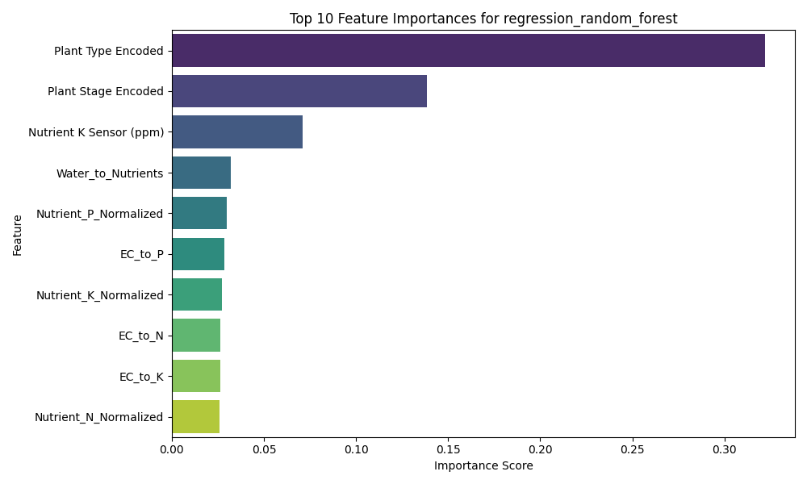
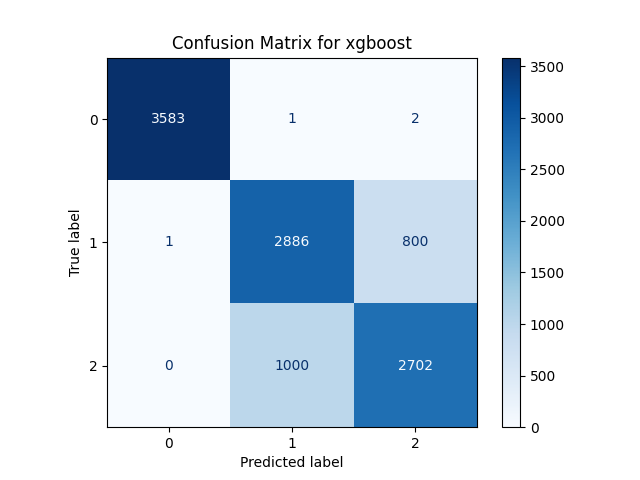
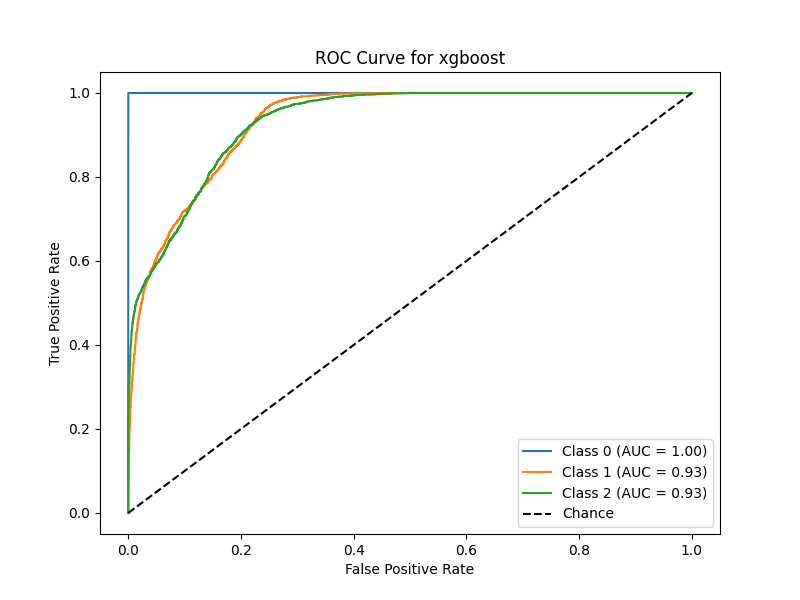
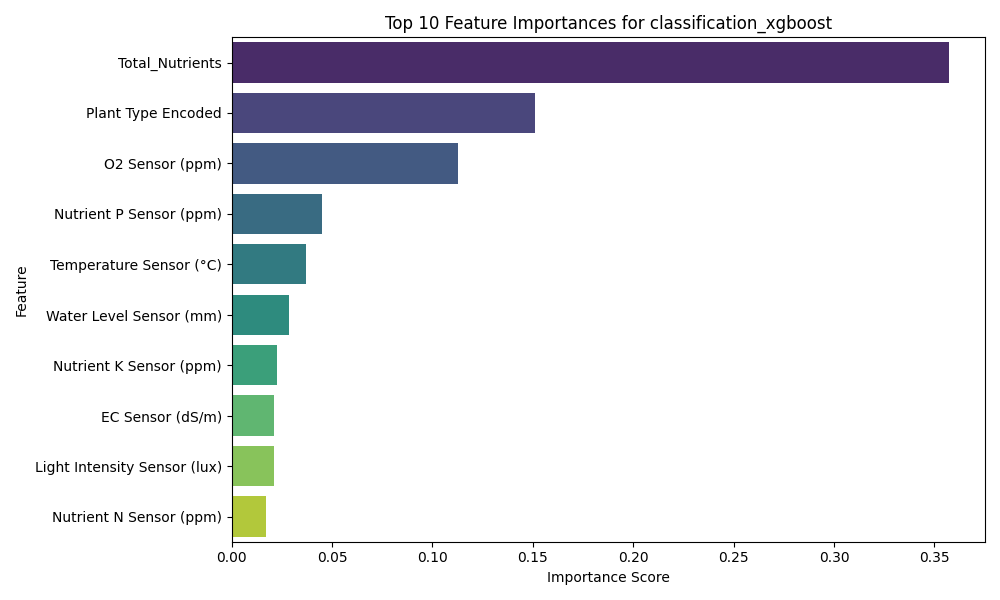

# **AgroTech Innovations Machine Learning Pipeline**

### **Author**
**Full Name:** Lim Long Jun Nathan  
**Email:** [limlongjunnathan@gmail.com]  

### **Chapters**
1. [Overview of the Folder Structure](#1-overview-of-the-folder-structure)
2. [Instructions for Executing the Pipeline and Modifying Parameters](#2-instructions-for-executing-the-pipeline-and-modifying-parameters)
3. [Logical Flow of the Pipeline](#3-logical-flow-of-the-pipeline)
4. [Key Findings from Exploratory Data Analysis (EDA)](#4-key-findings-from-exploratory-data-analysis-eda)
5. [Original and Engineered Features Table](#5-original-and-engineered-features-table)
6. [Explanation of Predictive Model Choices](#6-explanation-of-predictive-model-choices)
7. [Model Evaluation](#7-model-evaluation)
8. [Other Considerations for Deploying the Models Developed](#8-other-considerations-for-deploying-the-models-developed)
---

## **[1. Overview of the Folder Structure](#1-overview-of-the-folder-structure)**
```plaintext
├── Data/                        # Contains raw and preprocessed datasets
│   ├── agri_data.csv            # Raw dataset
│   ├── agri_data_cleaned.csv    # Preprocessed dataset
├── src/                         # Python scripts for the pipeline
│   ├── data_ingestion.py        # Handles data extraction from SQLite
│   ├── data_preprocessing.py    # Preprocesses and cleans the data
│   ├── training.py              # Handles model training and evaluation
│   ├── config.py                # Stores pipeline configurations
│   ├── visualizations.py        # Handles plot generation for evaluation
├── Plots/                       # Stores generated visualizations
│   ├── model_plots/             # Subfolder for saved model evaluation plots
├── run.sh                       # Bash script to run the end-to-end pipeline
├── requirements.txt             # Python dependencies
├── README.md                    # Project documentation
```

---

## **[2. Instructions for Executing the Pipeline and Modifying Parameters](#2-instructions-for-executing-the-pipeline-and-modifying-parameters)**

The simplified and streamlined version of your section for **Instructions for Executing the Pipeline and Modifying Parameters**:

---

### **2.1 How to Run the Pipeline**

The pipeline automates data ingestion, preprocessing, model training, evaluation, and visualization. It runs automatically or can be manually triggered.

#### **Triggering the Pipeline**
1. **Automatic Trigger (on Push):**  
   Push your changes to the repository, and the pipeline runs automatically:
   ```bash
   git add .
   git commit -m "Update"
   git push origin main
   ```

2. **Manual Trigger:**  
   - Go to the **Actions** tab in your repository.
   - Select the **AIAP Assessment 2** workflow.
   - Click **Run Workflow**.

---

### **2.2 Pipeline Workflow**

The pipeline includes the following steps, orchestrated by `run.sh`:

1. **Data Ingestion** (`data_ingestion.py`):  
   Extracts raw data from the SQLite database (`Data/agri.db`) and saves it as `Data/agri_data.csv`.

2. **Data Preprocessing** (`data_preprocessing.py`):  
   Cleans, preprocesses, and transforms the data for modeling, saving the result as `Data/agri_data_cleaned.csv`.

3. **Model Training and Evaluation** (`training.py`):  
   Trains regression and classification models, evaluates their performance, and generates visualizations in the `Plots/` folder.

4. **Visualization** (`visualizations.py`):  
   Dynamically generates key plots, such as:
   - Residual plots.
   - Predicted vs. Actual plots.
   - Confusion matrices.
   - ROC curves.
   - Feature importance charts.

---

### **2.3 Modifying Model Parameters**
---

To optimize model performance, edit the `config.py` file to adjust hyperparameters. Below is a guide for tuning the models used in both tasks.

| **Model**             | **Task**               | **Parameter**         | **Effect**                                                                                 | **Suggested Values**           |
|------------------------|------------------------|-----------------------|--------------------------------------------------------------------------------------------|---------------------------------|
| **Linear Regression**  | Regression            | -                     | No hyperparameters to tune; serves as a simple, interpretable baseline.                   | -                               |
| **Logistic Regression**| Classification        | `C`                   | Inverse of regularization strength. Smaller values apply stronger regularization.          | `[0.01, 1, 100]`               |
|                        |                        | `max_iter`            | Maximum iterations for convergence.                                                        | `[100, 200, 500]`              |
| **Random Forest**      | Regression/Classification | `n_estimators`        | Number of trees in the forest. More trees improve stability and performance but increase time. | `[50, 100, 200]`               |
|                        |                        | `max_depth`           | Maximum depth of trees. Higher depth captures complexity but risks overfitting.            | `[None, 10, 20]`               |
|                        |                        | `min_samples_split`   | Minimum samples required to split a node. Higher values make the model more conservative.  | `[2, 5]`                       |
|                        |                        | `min_samples_leaf`    | Minimum samples required in a leaf node. Higher values reduce complexity.                  | `[1, 2]`                       |
| **Gradient Boosting**  | Regression/Classification | `learning_rate`       | Shrinks the contribution of each tree. Smaller values improve accuracy but slow training.  | `[0.01, 0.1, 0.2]`             |
|                        |                        | `n_estimators`        | Number of boosting stages (trees).                                                        | `[100, 150, 200]`              |
|                        |                        | `subsample`           | Fraction of samples used for training each tree, reducing overfitting.                    | `[0.8, 1.0]`                   |
|                        |                        | `max_depth`           | Same as in Random Forest.                                                                 | `[3, 5, 10]`                   |
| **XGBoost**            | Regression/Classification | `learning_rate`       | Same as Gradient Boosting.                                                                | `[0.01, 0.1, 0.2]`             |
|                        |                        | `n_estimators`        | Same as Random Forest.                                                                    | `[100, 150, 200]`              |
|                        |                        | `max_depth`           | Same as in Random Forest.                                                                 | `[3, 5, 10]`                   |
|                        |                        | `subsample`           | Same as Gradient Boosting.                                                                | `[0.8, 1.0]`                   |
|                        |                        | `colsample_bytree`    | Fraction of features considered per tree. Helps regularization.                           | `[0.8, 1.0]`                   |
| **K-Nearest Neighbors**| Classification        | `n_neighbors`         | Number of neighbors to use. Higher values generalize better but reduce sensitivity.        | `[5, 10, 20]`                  |
|                        |                        | `weights`             | Weighting scheme for neighbors (`distance` gives closer neighbors more weight).            | `['uniform', 'distance']`      |
|                        |                        | `metric`              | Distance metric (e.g., Manhattan, Euclidean).                                              | `['manhattan', 'euclidean']`   |

---

### **2.4 Testing Locally**
Before triggering the pipeline on GitHub, run it locally to verify:
```bash
bash ./run.sh
```

---

### **Pipeline Outputs**
- **Processed Data**: `Data/agri_data_cleaned.csv`  
- **Visualizations and Metrics**: Saved in the `Plots/` directory, uploaded as artifacts in GitHub Actions.  
---

## **[3. Logical Flow of the Pipeline](#3-logical-flow-of-the-pipeline)**
```plaintext
1. Data Ingestion → 2. Data Preprocessing → 3. Model Training → 4. Evaluation & Visualization
```

### **Step 1: Data Ingestion**
- Extracts data from a SQLite database using `data_ingestion.py`.
- Saves the output as `agri_data.csv` in the `Data/` folder.

### **Step 2: Data Preprocessing**
- Handles missing values (e.g., imputation or removal).  
- Encodes categorical variables into numeric format.  
- Performs feature engineering (e.g., interaction terms like `Light_per_CO2`).  
- Outputs preprocessed data as `agri_data_cleaned.csv`.

### **Step 3: Model Training and Evaluation**
- Defines regression and classification tasks in `config.py`.
- Tunes hyperparameters using `GridSearchCV`.
- Evaluates models using metrics such as RMSE (for regression) and F1-score (for classification).
- Generates plots for residuals, predicted vs. actual values, confusion matrices, and feature importance.

---

## **[4. Key Findings from Exploratory Data Analysis (EDA)](#4-key-findings-from-exploratory-data-analysis-eda)**
---

### **4.1 Summary of Insights**
1. **Data Cleaning:**  
   - Dropped `Humidity Sensor (%)` due to 67.6% missing values.  
   - Addressed moderate missing values (6%-17%) like temperature, water level, nutrients sensor readings, using median imputation. 
   - Removed rows with negative values possibility due to sensor noise.
   - Encoded object type columns like Plant Stage, Plant Type and Previous Cycle Plant Type.
---

2. **Univariate Analysis:**  
    **Temperature, Light Intensity (lux), EC, O2, Nutrient N/P/K, pH, and Water Level Sensor:**
    - These variables show traits of normal distribution with abrupt peaks for one or two x-axis values, except for the EC sensor.

    **CO2 Sensor:**
    - The distribution is right-skewed.

    **Categorical Variables (Plant Type, System Location Code, Previous Cycle Plant Type, Plant Stage):**
    - These variables are **equally distributed** across categories.
    - This balanced distribution will be advantageous for predicting plant stages, as no single category dominates the dataset.
---

3. **Feature Engineering:**  
   - Created interaction terms, such as `Light_per_CO2` and `Water_to_Nutrients`, to improve model interpretability.  
   - Normalized nutrient ratios (e.g., `Nutrient_N_Normalized`) to ensure proportional contributions.  
---

4. **Correlation Analysis:**  
   - Temperature correlates moderately with `Log_Light_Intensity` (0.27) and `Light_per_CO2` (0.22).  
   - Plant Stage has strong correlations with `Total_Nutrients` (0.61) and negative correlations with `EC_to_P` (-0.69).  

### **Pearson Correlation Heatmap**


### **4.2 Assumptions About the Dataset**
To ensure clarity and context for analysis, the following assumptions were made about the data source:
- Synthetic data accurately mimics real-world conditions in terms of distributions and variability.
- Observations are independent unless specified otherwise.
- Sensor readings are assumed to be free of calibration errors.
- Any missing data is random and has been imputed appropriately.

---
### **[5. Original and Engineered Features Table](#5-original-and-engineered-features-table)**
In the table below, you will find feature description and how they are derived.

| **Feature**               | **Original or Engineered** | **Formula**                                                         | **Description**                                                                                           |
|---------------------------|---------------------------|---------------------------------------------------------------------|-----------------------------------------------------------------------------------------------------------|
| **Temperature Sensor (°C)** | Original                 |                                                                     | Temperature reading from the sensor, measured in degrees Celsius.                                         |
| **Light Intensity Sensor (lux)** | Original             |                                                                     | Light intensity measured by the sensor, in lux.                                                           |
| **CO2 Sensor (ppm)**       | Original                 |                                                                     | Carbon dioxide concentration measured by the sensor, in parts per million.                                |
| **EC Sensor (dS/m)**       | Original                 |                                                                     | Electrical conductivity measured by the sensor, in decisiemens per meter.                                 |
| **Nutrient N Sensor (ppm)**| Original                 |                                                                     | Nitrogen concentration measured by the sensor, in parts per million.                                      |
| **Nutrient P Sensor (ppm)**| Original                 |                                                                     | Phosphorus concentration measured by the sensor, in parts per million.                                    |
| **Nutrient K Sensor (ppm)**| Original                 |                                                                     | Potassium concentration measured by the sensor, in parts per million.                                     |
| **Plant Stage Encoded**    | Engineered (Encoded)     | `{'Seedling': 0, 'Vegetative': 1, 'Maturity': 2}`                  | Encoded representation of the plant's current growth stage.                                               |
| **Plant Type Encoded**     | Engineered (Encoded)     | `{'Vine Crops': 0, 'Herbs': 1, 'Fruiting Vegetables': 2, 'Leafy Greens': 3}` | Encoded representation of the current type of plant being grown.                                          |
| **Light_per_CO2**          | Engineered              | Light Intensity Sensor (lux) / CO2 Sensor (ppm)                    | Ratio of light intensity to CO2 concentration; indicates photosynthesis potential.                        |
| **EC_to_N**                | Engineered              | EC Sensor (dS/m) / Nutrient N Sensor (ppm)                         | Ratio of soil electrical conductivity to nitrogen concentration.                                          |
| **EC_to_P**                | Engineered              | EC Sensor (dS/m) / Nutrient P Sensor (ppm)                         | Ratio of soil electrical conductivity to phosphorus concentration.                                        |
| **EC_to_K**                | Engineered              | EC Sensor (dS/m) / Nutrient K Sensor (ppm)                         | Ratio of soil electrical conductivity to potassium concentration.                                         |
| **Water_to_Nutrients**     | Engineered              | Water Level Sensor (mm) / Total_Nutrients                          | Ratio of water level to total nutrients; indicates nutrient absorption capacity.                          |
| **Log_Light_Intensity**    | Engineered              | log(1 + Light Intensity Sensor (lux))                              | Log-transformed light intensity to reduce the effect of large values.                                    |
| **Log_CO2**                | Engineered              | log(1 + CO2 Sensor (ppm))                                          | Log-transformed CO2 concentration to reduce the effect of large values.                                  |

## **[6. Explanation of Predictive Model Choices](#6-explanation-of-predictive-model-choices)**

### **6.1 Task 1: Predicting Temperature (Regression)**

| **Model**                | **Advantages**                                                       | **Limitations**                                                         |
|--------------------------|-----------------------------------------------------------------------|-------------------------------------------------------------------------|
| **Linear Regression**    | - Simple, interpretable.<br>- Serves as a baseline.                 | - Poor performance for non-linear data.<br>- Sensitive to outliers.    |
| **Random Forest**         | - Handles non-linear relationships.<br>- Provides feature importances.| - Computationally intensive.<br>- Requires careful tuning.             |
| **Gradient Boosting**     | - Balances bias-variance trade-off.<br>- Captures complex patterns. | - Slow training.<br>- May overfit without tuning.                      |
| **XGBoost**               | - Optimized for speed and performance.<br>- Handles missing data.   | - Resource-intensive.<br>- Requires extensive hyperparameter tuning.   |

---

### **6.2 Task 2: Predicting Plant Stage (Classification)**

| **Model**                | **Advantages**                                                   | **Limitations**                                                      |
|--------------------------|-------------------------------------------------------------------|----------------------------------------------------------------------|
| **Logistic Regression**  | - Easy to interpret probabilities.<br>- Serves as a baseline.    | - Poor performance with non-linear decision boundaries.             |
| **Random Forest**         | - Robust to overfitting.<br>- Handles mixed feature types.       | - Computationally expensive.<br>- Time-consuming hyperparameter tuning. |
| **XGBoost**               | - Handles structured data efficiently.<br>- Prevents overfitting.| - Computationally intensive.<br>- Requires careful tuning.          |
| **K-Nearest Neighbors**   | - Non-parametric, flexible for clusters.<br>- No assumptions.    | - Sensitive to choice of `k`.<br>- Computationally expensive for large datasets.|

---

## *[7. Model Evaluation](#7-model-evaluation)**

## **Metrics Used**

| **Task**         | **Metric**  | **Why It’s Used**                                                  |
|-------------------|-------------|-------------------------------------------------------------------|
| **Regression**    | RMSE        | Penalizes large errors heavily; useful for measuring absolute error.|
|                   | MAPE        | Provides relative error in percentage; useful for scaled data.    |
| **Classification**| F1-Score    | Balances precision and recall; essential for imbalanced datasets. |
|                   | Accuracy    | Measures overall correctness; less effective for imbalanced datasets.|

---

## **Evaluation Results**

### **7.1 Temperature Prediction (Regression)**

| **Rank** | **Model**         | **RMSE**  | **Best Parameters**                                                             | **Time Taken (seconds)** |
|----------|-------------------|-----------|---------------------------------------------------------------------------------|--------------------------|
| 1        | Random Forest     | 0.9974    | `{'max_depth': None, 'min_samples_leaf': 1, 'min_samples_split': 2, 'n_estimators': 200}` | 486.96                   |
| 2        | XGBoost           | 1.0137    | `{'colsample_bytree': 1.0, 'learning_rate': 0.1, 'max_depth': 15, 'n_estimators': 150, 'subsample': 0.8}` | 94.98                    |
| 3        | Gradient Boosting | 1.0164    | `{'learning_rate': 0.1, 'max_depth': 15, 'min_samples_leaf': 1, 'min_samples_split': 2, 'n_estimators': 150, 'subsample': 0.8}` | 363.05                   |
| 4        | Linear Regression | 1.2789    | None                                                                            | 0.03                     |

#### **7.1.1 Key Insights:**
- Random Forest outperforms others with an RMSE of 0.9986, indicating high temperature prediction accuracy within 1°C variation.   
- XGBoost and Gradient Boosting are competitive alternatives but may outperform Random Forest with more extensive tuning.
- There is >5x difference in speed between XGBoost and Random Forest and only a small gap in performance. It is possible to choose XGBoost should speed be required.
- Linear Regression performs poorly due to its inability to handle non-linear patterns.

---

### **7.1.2 Further Insights from Best Model**

#### **Residual Plot (Random Forest)**
  
- Residuals are centered around zero, showing no significant bias.  
- Greater residual spread at higher predicted temperatures (23–26°C) indicates increased prediction variability.

#### **Feature Importance (Random Forest)**
  
- **Top Features:**  
  - `Plant Type`: Indicates significant impact on temperature prediction.  
  - `Plant Stage`: Growth stage influences environmental temperature.  
  - `Nutrient K`: Highlights potassium's importance in regulating plant growth. 


Here’s the improved section with the requested content and visualizations included:

---

### **7.2 Plant Stage Categorization (Classification)**

| **Rank** | **Model**         | **F1-Score** | **Best Parameters**                                                             | **Time Taken (seconds)** |
|----------|-------------------|--------------|---------------------------------------------------------------------------------|--------------------------|
| 1        | XGBoost           | 0.8355       | `{'colsample_bytree': 1.0, 'learning_rate': 0.1, 'max_depth': 15, 'n_estimators': 150, 'subsample': 0.8}` | 209.94                   |
| 2        | Random Forest     | 0.8311       | `{'max_depth': 20, 'min_samples_leaf': 1, 'min_samples_split': 2, 'n_estimators': 150}` | 63.33                    |
| 3        | KNN               | 0.7255       | `{'metric': 'manhattan', 'n_neighbors': 10, 'weights': 'distance'}`             | 43.27                    |
| 4        | Logistic Regression | 0.7024     | `{'C': 100, 'max_iter': 200}`                                                  | 5.26                     |
---

### **7.2.1 Key Insights:**

1. XGBoost outperformed other models with an F1-Score of 0.8355, demonstrating its ability to handle complex data relationships effectively.
2. Random Forest is a strong competitor, with a marginally lower F1-Score of 0.8311. It is simpler to interpret and requires fewer computational resources.
3. There is >3x difference in speed between XGBoost and Random Forest and only a small gap in performance. It is possible to choose Random Forest should speed be required.
4. K-Nearest Neighbors (KNN) and Logistic Regression underperformed, primarily due to their sensitivity to non-linearity and feature scaling.

---

### **7.2.2 Further Insights from the Best Model**

#### **Confusion Matrix for XGBoost**
  
- **Key Observations:**
  - Class `0` (Seedling stage) has a high precision and recall, with nearly all predictions correct.
  - Class `1` (Vegetative stage) and Class `2` (Maturity stage) show some misclassifications.
  - Most errors involve confusion between Classes `1` and `2`, which might result from overlapping features during these growth stages.

---

#### **ROC Curve for XGBoost**
  
- **Key Observations:**
  - **Class 0:** AUC = 1.00, indicating perfect discrimination.
  - **Classes 1 and 2:** AUC = 0.93 for both, reflecting strong predictive capability but room for improvement in separating these stages.

---

#### **Feature Importance for XGBoost**
  
- **Key Features:**
  1. **Total Nutrients:** The most influential feature, showing that nutrient availability strongly predicts plant stage.
  2. **Plant Type Encoded:** The second most critical feature, as different plant types progress through growth stages differently.
  3. **O2 Sensor (ppm):** Highlights the importance of oxygen availability in plant development.
  4. **Nutrient P Sensor (ppm):** Phosphorus levels are crucial for plant growth, especially during early stages.
  5. **Temperature Sensor (°C):** Indicates that environmental temperature is a significant factor influencing plant growth.

- **Additional Observations:**  
  Features like `Water Level`, `Nutrient K`, and `EC Sensor` also contribute but with lower importance. These might play a supporting role in stage classification.

---

## **[8. Other Considerations for Deploying the Models Developed](#8-other-considerations-for-deploying-the-models-developed)**

Model performance (e.g. prediction accuracy) is typically of the highest priority when doing smaller scale case studies.
However, when dealing with enterprise level scale, we have to consider more metrics when choosing model to deploy.

By addressing these considerations and understanding their impact, we can find room for improvement and ensure that the models are effective and cost efficient while minimizing risks and maximizing user satisfaction.

#### **8.1 Model Speed**
- **Importance**: Real-time applications require high speed predictions while being able to process large volumes of data.
- **Impact**: Delays in predictions can degrade user experience or system functionality, especially in time-sensitive applications like healthcare and finance where lives and wealth is at stake respectively.

---

#### **8.2 Scalability**  
- **Importance**: Can the model handle an increase in data volume or users? Does it still perform as well with distributed systems (e.g., cloud platforms)?  
- **Impact**: Limited scalability can lead to system failures or lag during peak usage. For example: If a buyer recommendation analytics and predictive model at an e-commerce is not scalable, during 12.12 sales or other high volume events, it may cause the shopping app to lag and impact user experience which may disrupt business operations, or worse, cause consumer confidence to wane.

---

### **8.3 Resource Utilization and Cost of Deployment**  
- **Why Important**: Resource usage (CPU, GPU, memory) impacts deployment costs and determines compatibility with resource-constrained environments like edge devices.  
- **Impact**: High resource utilization can increase operational costs, restrict model deployment to high-end hardware, and possibility reduce profitability.

---

### **8.4 Model Maintenance and Updates**  
- **Why Important**: Models can degrade over time as the data distribution changes and, new and existing data or features may need to be added or fine tuned.
- **Impact**: Poor maintenance can lead to outdated models, reducing system effectiveness. Proper version control and documentation allow ease of maintenace even when there are staff rotations ensuring minimal downtime.


### **Thank you for reading!**